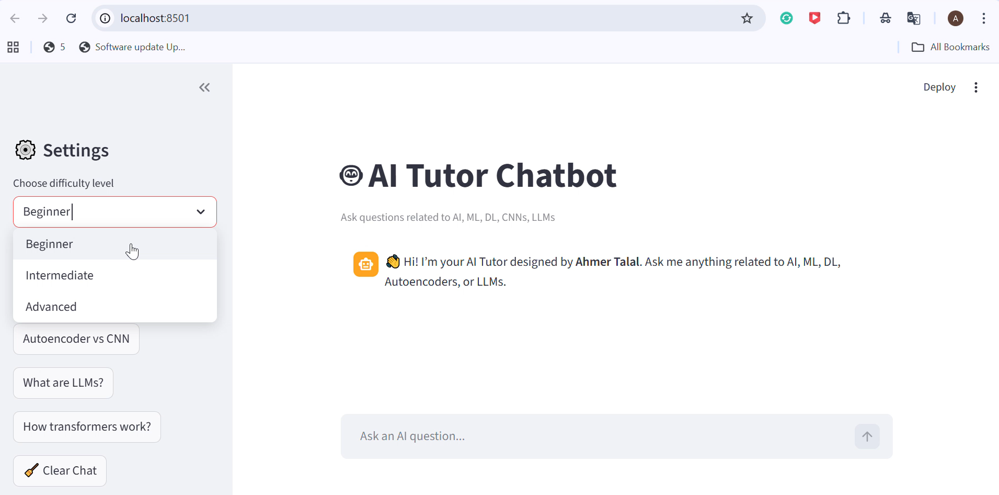
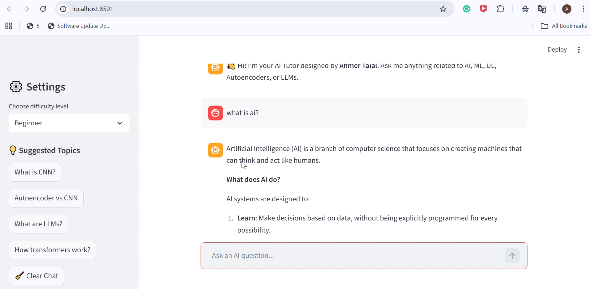
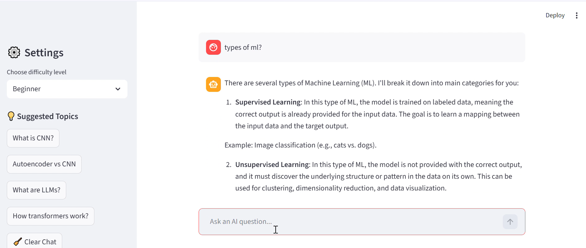

# AI Tutor Chatbot

A professional AI chatbot built with **Groq LLaMA** and deployed via **Streamlit**.  
The chatbot answers **AI-related queries only**, providing a clean and interactive interface for learning and testing AI concepts.

---

## Features

- AI-focused conversational assistant  
- Real-time chat interface with **Streamlit**  
- Maintains **recent chat history**  
- Start and end greetings for professional interaction  
- Filters non-AI topics automatically  
- Easily extendable to include additional AI topics

---
## 🎥 Project Demo
[Click here to watch the full demo video on Drive](https://drive.google.com/file/d/1FNsT4QorxNp5xdcUdt01x2v0lxHTMPao/view?usp=sharing)

## 📸 Screenshots

### Chat Interface

### 1st Query

### 2nd Query

